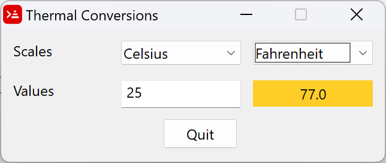

# Thermal Conversions

Often when I process thermal images, I have to perform temperature scale transformations, such as switching from a Kelvin scale to a Celsius scale. Of course, each time I forget the conversion formulas and have to look them up on the Internet.

I found some code written for Rebol 2 by Sylvain Maltais [meteoconv](https://www.gladir.com/CODER/REBOL/meteoconv.htm), who had implemented various conversion functions. So I've adapted his code for Rebol 3 (Oldes' version) and Red, and added a few extra functions. These functions are 100% compatible for both languages.

* MeteoConv.r: original R2 version
* tempConsole.r3: extended version for R3 (uses thermalScales.r3)
* tempConsole.red: extended version for Red (uses thermalScales.red)
* tempGui.red: a GUI Thermal Convertor

